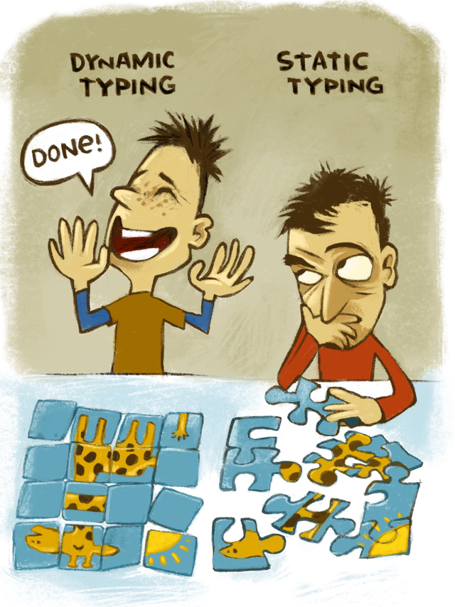
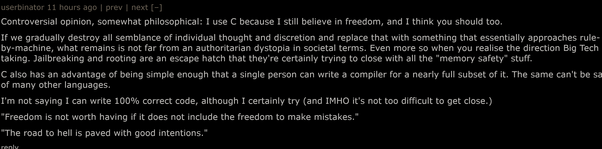
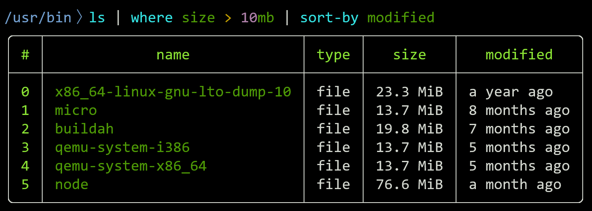
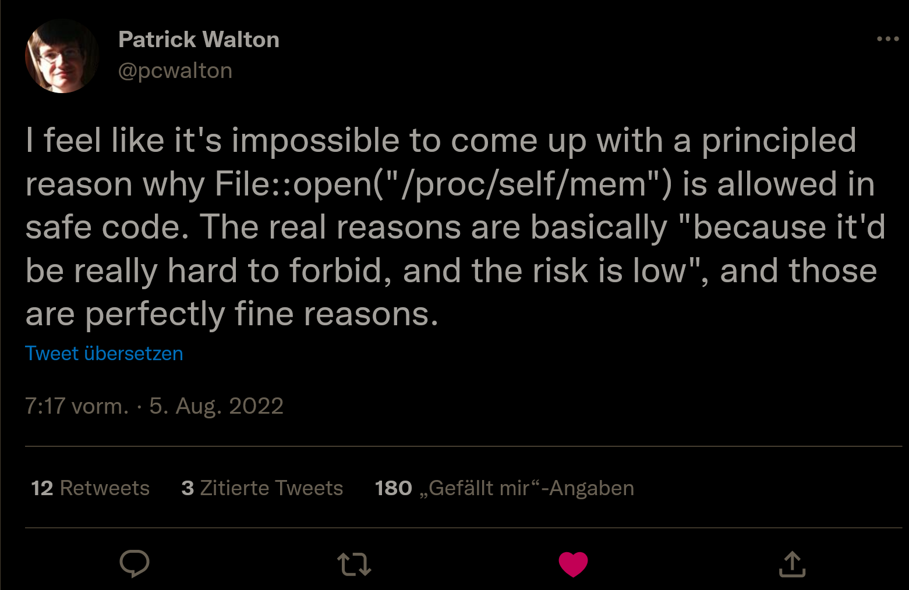
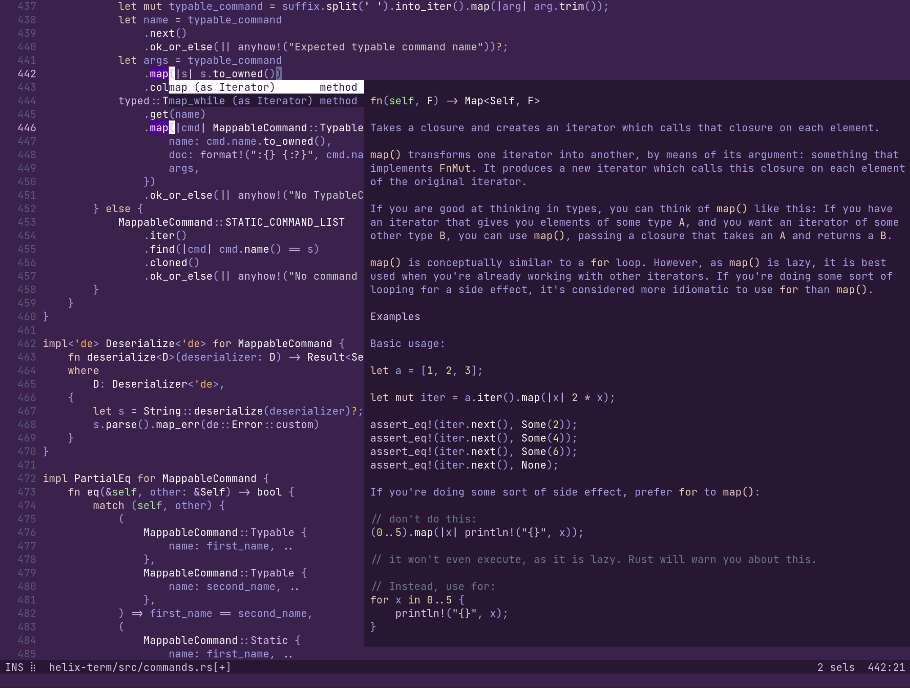
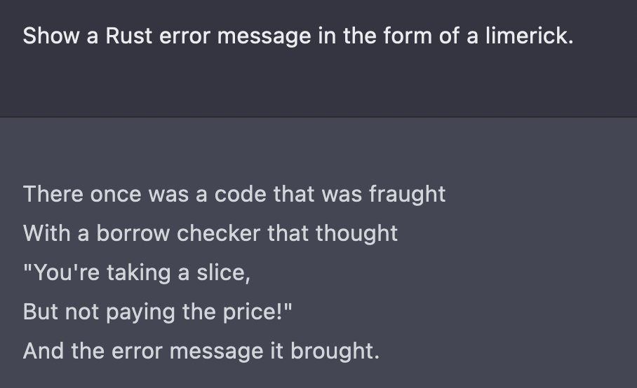

# RUST-a-RHYMES
*proudly presents*
<!--
My boss said this time I should try a Rust rap
but my rapping skills are positively crap,
Even so, Rust and rapping are a thrilling combination
with which to introduce my talk to RustNation

In London we meet, and the workshops are complete,
so now you people have my talk approaching at full speed,
wakey, wakey, here we are, and I hope you will get
entertainment out of this, or some knowledge instead

Of course I won't start right away with pages full of code
I'll start with a few stories, and then switch to teaching mode.
I hope that by the end you'll know a bit more than before
but otherwise enjoy the show, I'll try hard not to bore.

I could go on and on about how many talks are lacking
the silliness, the fireworks, just going straight to hacking,
so have some whimsy, have some rhyme, some bars, a little flow
we're here for having a good time, by golly, HERE WE GO!
-->
---

# RUST IN RHYMES Ⅱ

ᴛhe ʀʜymer's ʀevenge
<!--
Welcome to this talk, dear Rustacean,
You're hailing from many a nation,
And you've waited some time
for most uplifting rhyme
so let's start the edification!
-->
---

<!--
Someone from outside London got
his head in my hotel too hot
and the fire alarm
worked this night like a charm
and woke everyone up on the spot.
-->
---


<!--
Since I last talked in rhyme about Rust
I worked in Java and just
three years ago moved
to Rust which behooved
me to go in completely. Or bust.
-->
---


<!--
JFrog, from the name you suppose
they used Java a while, and now those
folks who work to contain
err'rs in our supply chain
they're here getting their five lines of prose.
-->
---

## @TryBloop
<!--
Nowadays I write Rust to help you
getting into Rust code old and new
It will show you the code
and in semantic mode
it will also explain what's it do.
-->
---


(Google Trends: Rust Programming Language)
<!--
Rust's steadily been on the rise,
to no Rustacean's surprise
many people take note
of our bug-antidote
without any speed compromise.
-->
---


<!--
Rust has now made it on TV
where hackers compiling you see
so join us and write
Rust code with shades by night
if you want as cool as them to be.
-->
---


<!--
Sometimes in Rust you will need
more time 'til your code is complete
Where in Python you're "done"
When the code is still wrong
And on perf it'll never compete.
-->
---


<!--
There once was a runtime called bun
who thought beating Rust perf was fun.
Rustaceans said "please
bench with dash-dash-release"
Now look at the benchmarks...they're gone.
-->
---

 
<!--
With Rust and Ada some find
them competing for shares of our mind
Ferrous and AdaCore
thought "we might achieve more
by applying our powers combined!"
-->
---


<!--
The Ferrocene scheme will contain
necessary steps to obtain
a Rust certified to
ISO 2 6 2 6 2
Let's hope the effort's not in vain.
-->
---


<!--
Some functional zealots will tell
that mutation can never go well
but if we never share
what's mutated, we spare
us from data race debugging hell.
-->
---


<!--
Some coders will still look in vain
for reasons with C to remain
but "freedom" to crash
is an unholy mash
of stupidity, hubris and pain.
-->
---

"For example, the Microsoft Visual Studio analyzer and its memory-safety profile deliver much of
the CG support today and any good static analyzer (e.g., Clang tidy, that has some CG support) could be
made to completely deliver those guarantees at a fraction of the cost of a change to a variety of novel
“safe” languages."

&nbsp; &nbsp; &nbsp; &nbsp; &nbsp; &nbsp; &nbsp; &nbsp; &nbsp; &nbsp; &nbsp; &nbsp; – B. Stroustup
<!--
Bjarne wants C++ to sprout
some memory safety without
needing more than some lint
Well, good luck, and a hint:
That's what Rust's type system is all about.
-->
---


<!--
The Rust foundation is here
not to mandate, prescribe, boss or steer,
they support from within
Rustaceans for the win,
so let's everyone give them some cheer!
-->
---

**This Week in Rust**
——————————————————————————

# *Handpicked Rust updates, delivered to your inbox.*

Stay up to date with events, learning resources, and recent developments in the Rust community.
<!--
By this time you probably just
have heard elsewhere of This Week in Rust.
I collect crate and quote
and PRs people wrote
for our main source of Rust news you trust.
-->
---

`184594741, 2880289470, 2881141438, 2965027518, 2976579765, 3203381950, 3405691582, 3405697037, 3735927486, 3735932941, 4027431614, 4276992702`

<!--
There was a certain Rust PR
that some folks think went too far
make internal code omit
certain numbers, to wit
in hex they'd fill the swearing jar.
-->
---


<!--
In Rust you will gladly embrace
the compiler's help if you face
a refactor so hairy
your brain's feeling airy
It'll keep track of time, stuff and space.
-->
---


<!--
We all have learned that a bad
craftsman blamed the tools that they had
but Rust will well teach
us it's not out of reach
to build far better tooling instead.
-->
---


<!--
For Androids it's been a must
To be shiny and free of Rust
But to safety's advance
Google loosened their stance
hoping blue tooths no longer combust.

Now in Android version thirteen
there's more Rust than ever has been.
But now that they wrote
millions Rust lines of code
memory bugs remain to be seen. 
-->
---


<!--
Meanwhile Rust in Linux progressed
to the point where it's put to the test,
The patch builds the foundation
for the carcination
of drivers. This stuff is the best!
-->
---


<!--
Asahi Lina just took
the GPU of a Macbook
to write drivers in Rust
for Linux, one must
think this is an elite-worthy look.

15 thousand lines of Rust code later
Despite claims from many a hater
Lina's work here shows
How kernel dev goes
Without any in-GPU crater.
-->
---


<!--
When your Rust goes embedded, you'll find
no need to leave abstractions behind,
with a HAL (not the boor
who won't open the door)
you get a piece of low-level mind.
-->
---


<!--
When asked curl in Rust to rewrite
Daniel Stenberg said that he might
But he won't rearrange
everything in one change
So it sure won't be done overnight.
-->
---


<!--
Rust would be far too arcane
Without Esteban keeping us sane
for the message on error
sparks joy and not terror
though the steep learning curve does remain.
-->
---


<!--
When rustc surprisingly showed
it converts a large int to a float
Mara Bos went complete-
ly berserk for more speed
the compiler's builtins to demote.
-->
---


<!--
Nyx toolkit brings Rust into space
as other tools they replace
at speed they simulate
how craft accelerate
at this scale you can't let data race.
-->
---


<!--
nushell builds on Rust to be able
to work with data by the table
and letting you pipe
your data with type.
It's elegant, mighty and stable.
-->
---

# <!-- fit --> :warning: rustdecimal<br>≠<br> :ok: rust-decimal
<!--
If your code depends at any rate
on the so-called "rustdecimal" crate
and you also did choose
Gitlab CI to use
Check your systems before it's too late.
-->
---

```rust
enum Talk {
    Boring(TechnicalStuff),
    Interesting(Rhymes),
};
```
<!--
Rust enums enjoy much attention,
well deserved, so allow me to mention
with `match` they enable
us to code more stable
and refactor to match our intention.
-->
---

```rust
assert!(
    matches!(
        this_talk,
        Talk::Interesting(_),
    )
)
```
<!--
Now if you just need a bool
from a match, this macro is cool
unless you must take out
of your type, it's about
the best match code-size reducing tool.
-->
---

```rust
pub trait Xorable {
    type Output;
    fn xored(self) -> Self::Output;
}

impl<T: BitXor, I: Iterator<Item = T>> Xorable for I
where <T as BitXor>::Output = T {
    type Output = T;
    fn xored(self) -> T {
        self.reduce(BitXor::xor)
    }
}
```
<!--
With traits your code faces ascension
by internal Rust type extension
where you tell everything
how to do anything
so allow me the pay-offs to mention.
-->
---

```
$ RUST_BACKTRACE=1 cargo t --test precondition
error: custom attribute panicked
 --> tests/precondition.rs:3:1
  |
3 | #[contracts]
  | ^^^^^^^^^^^^
  |
  = help: message: unexpected end of input, expected semicolon
```
<!--
When in Rust code macros you use
I worry a hard way you choose
for debugging it might
become heck of a fight
which means more time later you lose.
-->
---

```rust
let mut x = get_x();
mutate_x(&mut x);
let x = x;
// x is now immutable
```
<!--
In Rust when a thing you mutate
And desire to annotate
that it no longer should
change you easily could
`let` it be itself until its fate.
-->
---

```rust
'scope: { ..
    if broke { break 'scope; }
    ..
}
let result = 'scoop { ..
    if let Some(value) = scoop() {
        break 'scoop value;
    }
    default_value
};
```
<!--
Last time I showed how to break Rust
but this easter egg is now dust,
here's how out of a scope
you can jump without rope
which is useful and far more robust.
-->
---

```rust
let mut x = 1;
// behold: do-while!
while {
    x += 1;
    x < 10
} {}
```
<!--
Rust loops come in many a style
but few know it too has a do-while
though its looks may bemuse
you can put it to use
and rest assured it'll compile.
-->
---

```rust
fn foo(v: &Vec<u32>) {
    // bounds checked `Vec` index
    for i in 0..v.len() { bar(v[i]) }
    // no bounds check on slice index
    let v = &v[..];
    for i in 0..v.len() { bar(v[i]) }
}
```
<!--
Sometimes iterating a `Vec`
by index incurs a bounds check
however a slice
often won't, which is nice.
So go get your runtime perf back.
-->

---
# <!-- fit --> `Result<(), ()>`
<!--
Just sometimes a Rust Result looks
like an owl sitting on stacks of books.
With two units as eyes,
on embedded it flies
over meadows and forests and brooks.
-->

---

# <!-- fit --> `|_|()`

<!--
Rust has special syntax to let
you a function to drop values get
It is named for its looks
toilet closure, the books
tell you to use mem::drop instead.
-->
---

```rust
(a, b) = (b, a);
```

## Look ma, no `let`

<!--
In Febuary a year ago
Rust one-fiftynine stole the show
with assignments that could
destructure where you would
do multiple ones, now you know.
-->
---

# <!-- fit --> `_ = foo();`
<!--
One cool byproduct of this option
that has not seen too much adoption
is that you can ignore foo
without `let` as you do,
it's a small RSI antitoxin.
-->
---

```rust
let Some(x) = y
else { return };
```
<!--
Rust used to use `let` but with any
irrefutable bindings, so many
uses where one would guard
the code was somewhat hard
now you get them a dozen a penny.
-->
---


<!--
Atomics allow you to choose
what ordering on access to use.
While on X-eighty-six
You may easily mix
them, on ARM the results may confuse.

Know what that is? A memory fence.
-->
---

```rust
let range = 0..16;
for i in range.clone() { // why???
    ..
}
for i in range { .. }
```
<!--
In Rust you may know that the Range
type does not impl Copy, how strange!
But I've heard that some fine
folks hatch plans to combine
their powers this to rearrange.
-->
---

```rust
// look ma, no box! 📦
let (mut stdin_read, mut file_read);
let readable: &mut dyn io::Read = if arg == '-' {
    stdin_read = io::stdin();
    &mut stdin_read
} else {
    file_read = fs::File::open(arg)?;
    &mut file_read
};
```
<!--
Sometimes dyn traits in Rust do require
thinking outside the box to acquire
a solution to track
different types on the stack
to quench our full-stack desire.
-->
---


<!--
To many a newbie's surprise
we oft' use a str slice
for a lot of stuff
borrowing is enough
and not needing more memory is nice.
-->
---


<!--
To defer a task isn't hard,
in Rust you can just use a guard
which is a type that
does on drop what you had
it in mind to complete from the start.
-->
---


<!--
When a large naïve linked list you drop
your program will crash and then stop
for you'll exhaust the stack
from there it's no way back
so please do manual while-let-pop.
-->
---


<!--
With Rust, every coder feels safe,
so some venture ever so brave
into OS flaws to
poke some holes into
the cover to then rant and rave.
-->
---

```toml
# In Cargo.toml
[package.metadata.docs.rs]
all-features = true
```
<!--
When in Rust crates features you use
and don't ask for docs.rs to choose
to document all
it's dropping the ball,
as with features it's somewhat obtuse.
-->
---

```rust
#![feature(portable_simd)]
use std::simd::f32x4;
fn main() {
    let x = f32x4::from_array([0., 1., 2., 3.]);
    dbg!(x * 2.)
}
```

```
$ rustc +nightly simd.rs -O && simd             
[simd.rs:7] y = [
    0.0,
    2.0,
    4.0,
    6.0,
]
```
<!--
A cool thing in nightly rust be
called "portable SIMD",
which means you can say
in a cross-platform way
how instructions should parallel be.
-->
---

```rust
use std::marker::PhantomData;

type NoSend = PhantomData<*mut u8>;
type NoSync = PhantomData<Cell<u8>>;

struct MyType(usize, NoSend, NoSync);
```
<!--
If your code has the requirement
that a type be not Sync or not Send
it's time to introduce
a phantom to choose
which type's contract you will amend.
-->
---

```rust
let x = [1, 2];
let mut sum;
std::thread::scope(|s| {
    s.spawn(|| dbg!(x));
    s.spawn(|| sum = x[0] + x[1])
});
```
<!--
thread::scope, the first time around
Rust one-zero, alas, was unsound
But if you're keeping track
you know that it's back,
this time with correct lifetime bound.
-->
---

```rust
// Cow says Moo
let mut cow = Cow::Borrowed("Clone on write");
cow += " makes ownership optional";

cow.as_mut().make_ascii_uppercase();
```

<!--
I told you about Cow last time
but failed to mention in my rhyme
that you can assign-add
change in-place what you had
here as_mut is its partner in crime.
-->
---

```rust
let world = "Rust world";
println!("Hello, {world}");
```
<!--
Formatting macros now combine
format strings with arguments inline!
Note that this will fail to
work with all things you do
not in local bindings define.
-->
---

```rust
async fn wait_what() {}

wait_what(); // .await!
```
<!--
When in Rust async functions you call
they don't do any work at all
instead they will wait
for you to await
them, this might cause your program to stall
-->
---


<!--
When in Rust async code you borrow
across an `await`, you reap sorrow
for those two things don't mix
but with `Arc` you might fix
your code's problems until tomorrow.
-->
---

# <!-- fit --> 🚮

<!--
When a future no longer you need,
and you won't wait for it to complete,
you `drop` it, it's gone
there's no need to hold on,
and your other code works at full speed.
-->
---


<!--
Rust hashmaps have some subtle tricks
now throw `rustc-hash` into the mix
if you do not expect
to be perf-wise attacked
use the hasher it has called Fx.
-->
---

```rust
use std::io::BufWriter;
let out = BufWriter::new(out);
for line in lines {
    out.write_all(line.as_bytes())?;
    out.write_all(b"\n")?;
}
```
<!--
When in Rust you're coding for speed
and write to a file, you will need
to buffer the write
or your system might
wait for every byte to complete.
-->
---

```rust
use std::io::Write as _;
let mut stdout = std::io::stdout();
let mut locked = stdout.lock(); // <--
for line in lines {
    writeln!(locked, "{}", line)?;
}
```
<!--
Likewise it may come as a shock
all your `println!` calls silently block
on standard out, be aware
if for speed you do care
in that case best use standard out's `lock`.
-->
---

```rust
unsafe { rust() }
```
<!--
Those decrying Rust's unsafe 'scape hatch
because it "kills all safety", natch?
Most experts will tell
that it works pretty well
if all invariants you do catch.
-->
---

```rust
let orig_len = unsafe {
    let ref_text = &text;
    text += " mutated";
    ref_text.len()
};
```
```
error[E0502]: cannot borrow `text` as mutable because it is also borrowed as immutable
 --> src/main.rs:4:9
  |
3 |         let ref_text = &text;
  |                        ----- immutable borrow occurs here
4 |         text += " mutated";
  |         ^^^^^^^^^^^^^^^^^^ mutable borrow occurs here
5 |         ref_text.len()
  |         -------------- immutable borrow later used here
```
<!--
Some people tell you `unsafe` will
turn of borrowck and then shill
for C, which is why
they tell this bald lie
because rustc is checking things still.
-->
---


<!--
When in unsafe Rust code you write
and get some things not quite right
it's no longer the season
for rhyme nor for reason
though your program may run out of spite.
-->
---

```rust
#[test]
fn test_fail() {
    assert!(fail());
}
```
<!--
Though Rust saves you from a large class
of errors when RAM you amass,
it won't fix any test
on it's own, so you best
make sure that each one does pass
-->
---


<!--
When rustc with garbage you feed
Don't fret if the errors you read
Are confusing as hell
The compiler goes: "Well,
I'm telling you straight what 𝐼 need."
-->
---

```rust
#[derive(Zeroize, ZeroizeOnDrop)]
struct Secret(Vec<u8>);
```
<!--
When secrets you handle in Rust,
deleting them safely you must,
so you don't get hacked
and your defenses cracked.
The zeroize crate I would trust.
-->
---
```rust
#[policy(
    entities = (
        user: Session,
        document_metadata: DocumentMeta
    ),
    guard = (
        user is Owner for document_metadata
    )
)]
pub trait DocumentOwnerPolicy { .. }
```
<!--
Dacquiri: you'd normally think
I was rhyming while having a drink.
But in Rust it describes
A framework to use types
so folks can't step over the brink
-->
---


<!--
Andrew Gallant of ripgrep fame
is upping Rust's byte string game
to make prodding with Rust
real-world data robust
with impressive performance to claim. 
-->
---


<!--
If a Rust library you change
to avoid things downstream going strange
you can deftly depend
on what future amend
you're going to pre-re-arrange.
-->
---

# `$ clap # if you're happy`
<!--
If in Rust code you need to parse
some args either dense or sparse
where one went for structopt
this dependency stopped
as now clap pulls it out of its...derives.
-->
---


<!--
A bevy of games, not of geese
in Rust is a sight that will please
so join in the fun
get some Rust games to run
you'll find one can do that with ease.
-->
---


<!--
With tauri you stand on the shoulder
of web tech giants, tread bolder
to build quick applications
in all variations
and run them before getting older.
-->
---


<!--
When some Rustaceans exercise
their muscles, it's not very nice,
their squats at any rate
each go on their own crate
so that others need to improvise.
-->
---

```c
$ cargo nextest run
  Finished test [unoptimized]
  Starting 5 tests across 2 binaries
       PASS [ 0.002s] tests::types::serialize
       PASS [ 0.002s] tests::types::deserialize
       PASS [ 0.003s] types::create
       PASS [ 0.001s] types::emit
       PASS [ 0.005s] types::full
    Summary [ 0.013s] 5 tests run: 5 passed, 0 skipped
```
<!--
We're surprised to hear cargo test
Is speedwise no longer the best
so I'll gladly install
nextest, after all
my cores don't need too much rest.
-->
---


<!--
insta will easily check
if the objects your test code gets back
are the same as before
when a good state they bore
so your tests are quickly on track.
-->
---

# <!-- fit --> ❌ cargo deny
<!--
From Embark in Stockholm says hi
the subcommand `cargo deny`
which will thoroughly see
your dependency tree
through for...wow, lots of problems, oh my.
-->
---


<!--
Clippy users who at first sense
they're constantly making amends
To make their code "good"
(as they probably should)
will later become lifelong friends.
-->
---

# <!-- fit --> `$ cargo clippy --fix`
<!--
cargo clippy now has dash-dash-fix
which changes your code's subpar schticks
to improve it's style
and perf, and meanwhile
it has got up it's sleeve some more tricks.
-->
---


<!--
The clippy workshop went great
most people stayed with us late
with good work, much respect,
clippy lints to correct
and also new lints to create
-->
---

```
$ cargo semver -h
usage: cargo semver [options]

Options:
    -h, --help          print this message and exit
    -V, --version       print version information and exit
    -e, --explain       print detailed error explanations
    -q, --quiet         suppress regular cargo output, print only important
                        messages
        --show-public   print the public types in the current crate given by
                        -c or -C and exit
    -d, --debug         print command to debug and exit
    -a, --api-guidelines
                        report only changes that are breaking according to the
                        API-guidelines
        --features FEATURES
                        Space-separated list of features to activate
        --all-features  Activate all available features
```
<!--
cargo semverver will check
if your current crate version is back-
 wards compatible and
warn if change is on hand
that gives users a pain in the neck.
-->
---


<!--
Your performance desire to quench
you can put your code on the bench
but to make it complete
a criterion you need
lest measurement errors avenge.
-->
---


<!--
A helix of Rust can be made
to work on the code you create.
Between entering code
you switch to command mode
with complete & assists, it is great!
-->
---


<!--
With the crypto winter afoot,
Rust jobs are now mostly good
in search, cloud, UI
embedded, AI,
if you haven't applied yet, you should.
-->
---

# <!-- fit --> ::<>
<!--
Should I buy an aquarium, my wish
is to fill it with Rust turbofish
One fro, one reverse
(to complete this verse)
& a TV with satellite dish.
-->
---


<!--
Festive Ferris the Crab crossed the street
a bunch of gophers to meet,
and pythons and others
all FFI brothers
to get something to drink and to eat.
-->
---


<!--
If you tell people that they must
from now on write all code in Rust
you will earn some 'aw, shucks',
for your lobbying sucks.
Good luck on regaining their trust.
-->
---


@llogiq
<!--
If your thirst for rhymes isn't quenched
and your love of Rust is entrenched
you'll find more of my verse
on Twitter -- or worse
if that service is tabled -- or benched.
-->
---


<!--
An ML model showed it could rhyme
about Rust in a fraction of time
it does take me to write
a poem, I won't fight
it 'cause having more rhymes is sublime.

Well, tickle me pink! I admire,
this work, for now I can retire
and sit on a beach
a stiff drink in my reach.
Why should this AI draw my ire?
-->
---

# <!-- fit --> :wave:
<!--
Farewell now my friends, time to go
I hope you're enjoying the show
and thank you so much
for you being such
a great audience! Cheerio!
-->
